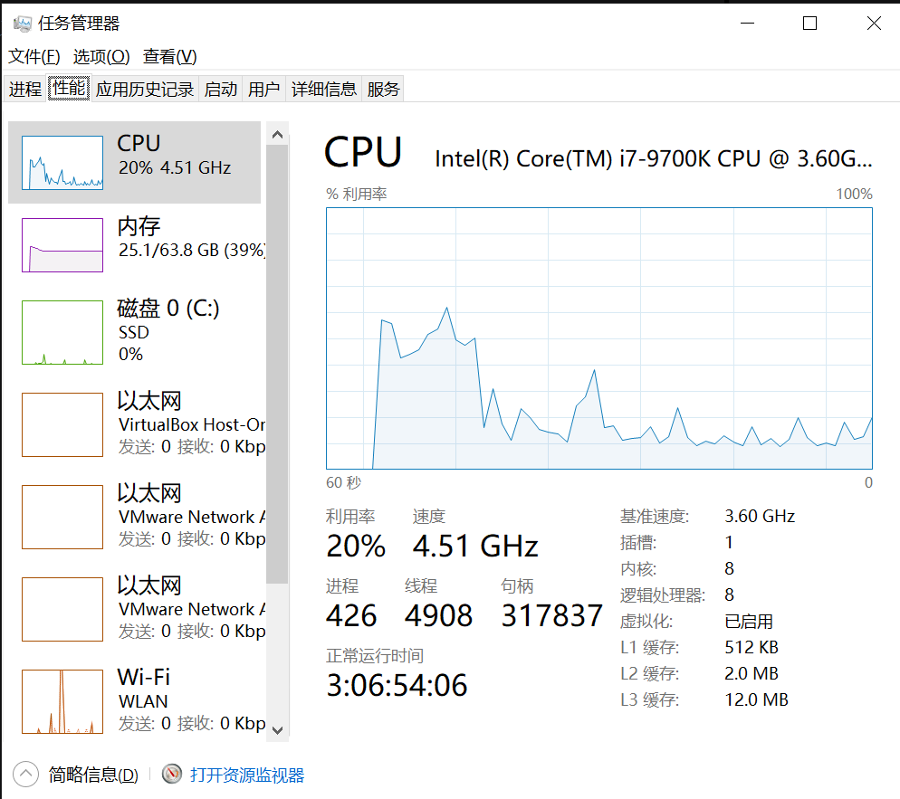

# 扔掉虚拟机，在Windows下用Kali，爽！


## 第一步：查看你的windows机器支不支持虚拟化。
WSL2 是基于hyper-V的，所以windows 机器必须支持虚拟化。如果是虚机的那就要支持嵌套的虚拟化。
网上一堆看BIOS的太麻烦了。简单的方法就是查看一下Windows 的任务管理器里的CPU选项
虚拟化。


## 第二步：升级系统

首先我们需要升级系统到Windows2004版本，如果不知道版本的，可以按Win+R，输入winver，可以看到当前的系统版本：


## 第三步：安装装下Windows terminal
这个直接在Windows的商城下载就行，是一个免费软件


## 第四步：两行代码，安装WSL组件

```
dism.exe /online /enable-feature /featurename:Microsoft-Windows-Subsystem-Linux /all /norestart
dism.exe /online /enable-feature /featurename:VirtualMachinePlatform /all /norestart

```

正常的显示结果如下：
```
PS C:\Users\lxodg> dism.exe /online /enable-feature /featurename:Microsoft-Windows-Subsystem-Linux /all /norestart

部署映像服务和管理工具
版本: 10.0.19041.844

映像版本: 10.0.19042.1237

启用一个或多个功能
[==========================100.0%==========================]
操作成功完成。

PS C:\Users\lxodg> dism.exe /online /enable-feature /featurename:VirtualMachinePlatform /all /norestart

部署映像服务和管理工具
版本: 10.0.19041.844

映像版本: 10.0.19042.1237

启用一个或多个功能
[==========================100.0%==========================]
操作成功完成。

```

## 第五步 安装WSL内核更新并设定WSL2为默认版本

在windows官网中文版缺少了下载地址，可以直接用以下地址：
https://wslstorestorage.blob.core.windows.net/wslblob/wsl_update_x64.msi

在powershell或者windows terminal 里面输入
```
wsl --set-default-version 2

PS C:\Users\lxodg> wsl --set-default-version 2
有关与 WSL 2 的主要区别的信息，请访问 https://aka.ms/wsl2
操作成功完成。

```

## 第六步 windows商店下载所需的Linux版本


我们这里以kali linux为例

## 第七步 启动Linux

安装好后可以直接windows左下角搜索，比如我们安装的是kali linux，搜索kali就可以找到。
第一次启动需要设置用户名和密码，我们设置乐学偶得（网站：lexueoude.com 公众号：乐学偶得）的拼音


```
Installing, this may take a few minutes...
Please create a default UNIX user account. The username does not need to match your Windows username.
For more information visit: https://aka.ms/wslusers
Enter new UNIX username: lexueoude.com
New password:
Retype new password:
passwd: password updated successfully
Installation successful!
┏━(Message from Kali developers)
┃
┃ This is a minimal installation of Kali Linux, you likely
┃ want to install supplementary tools. Learn how:
┃ ⇒ https://www.kali.org/docs/troubleshooting/common-minimum-setup/
┃
┗━(Run: “touch ~/.hushlogin” to hide this message)
┌──(lexueoude㉿DESKTOP-KIAISS2)-[~]
└─$
```

## 第八步：设置root密码与安装基本工具

目前我们还没有设置root密码，我们可以按照下方指令进行root修改


```
┏━(Message from Kali developers)
┃
┃ This is a minimal installation of Kali Linux, you likely
┃ want to install supplementary tools. Learn how:
┃ ⇒ https://www.kali.org/docs/troubleshooting/common-minimum-setup/
┃
┗━(Run: “touch ~/.hushlogin” to hide this message)
┌──(lexueoude㉿DESKTOP-KIAISS2)-[~]
└─$ sudo passwd root

We trust you have received the usual lecture from the local System
Administrator. It usually boils down to these three things:

    #1) Respect the privacy of others.
    #2) Think before you type.
    #3) With great power comes great responsibility.

[sudo] password for lexueoude:
New password:
Retype new password:
passwd: password updated successfully
```

然后我们至少先安装下vim，因为后续要进行换源操作（国内用户建议换源，否则速度极慢，完整版安装会耗时1-2天）

```
sudo apt-get install vim
sudo vim /etc/apt/sources.list
```

根据乐学偶得这边教研的测试，国内中科大的源速度最快，可以直接粘贴下方的

```
#中科大

deb https://mirrors.ustc.edu.cn/kali kali-rolling main non-free contrib
deb-src https://mirrors.ustc.edu.cn/kali kali-rolling main non-free contrib
```

注意，保存退出vim按下 ：wq!
然后sudo apt-get update更新即可。

接着就可以尽情安装完整版了
```
sudo apt-get install kali-linux-everything
```


